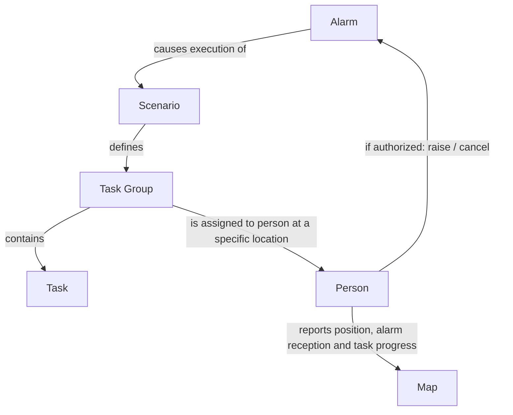

# Siren (pol. Wyjec)

**Siren** is a flexible system for distributing tasks and coordinating people during emergencies, based on predefined scenarios. It is intended for organizations that need to coordinate a response across people, tasks, and locations, including civil administration, medical services, and the military.

When an alarm is raised, it activates an associated scenario. A scenario defines one or more task groups; each group contains tasks and is assigned to a person at a specific location.

## How It Works

1. An authorized person raises an alarm.
2. The alarm activates its associated scenario.
3. Task groups are distributed to the people and locations specified by the scenario.
4. Participants report alarm reception and task progress. When enabled and available, their positions can also be shown on a map.
5. An authorized person can cancel the alarm.

## Concepts

- **Alarm:** An event that starts or cancels an emergency response.
- **Scenario:** A predefined response plan associated with an alarm.
- **Task group:** A set of tasks assigned to a person at a location.
- **Assignment:** The person and location responsible for carrying out a task group.

Alarms can be raised and cancelled by authorized people.

Scenarios are distributed to devices and stored offline. Alarm delivery is designed not to require the Internet or a centralized server, and can use different communication technologies. Actual delivery still depends on an available communication path; offline devices can use their stored scenarios but cannot exchange updates until a path is available.

During an active alarm, the system can collect participants' alarm reception status, task progress, and, when available, position to provide an overview on a map. Location collection should be limited to what is needed for the response, with access and retention governed by the deploying organization.

## Triple Use

### CIV — Civil Administration

**Air raid alarm**

A school principal is ordered to go to the school and prepare it as a shelter:

- open the building,
- open the shelter,
- display required signs.

### MED — Medical

**Mass-casualty alarm in the Emergency Department**

An emergency response scenario assigns medical staff to specific locations:

- anesthesiologist → Emergency Department,
- surgeon → operating theatre,
- nurses → triage area,
- radiology technician → imaging department.

### MIL — Military

**Mobilization alarm**

A soldier is ordered to:

- go to the equipment store where he collects equipment and takes ammunition
- go to designated bunker where he takes up a guard position
