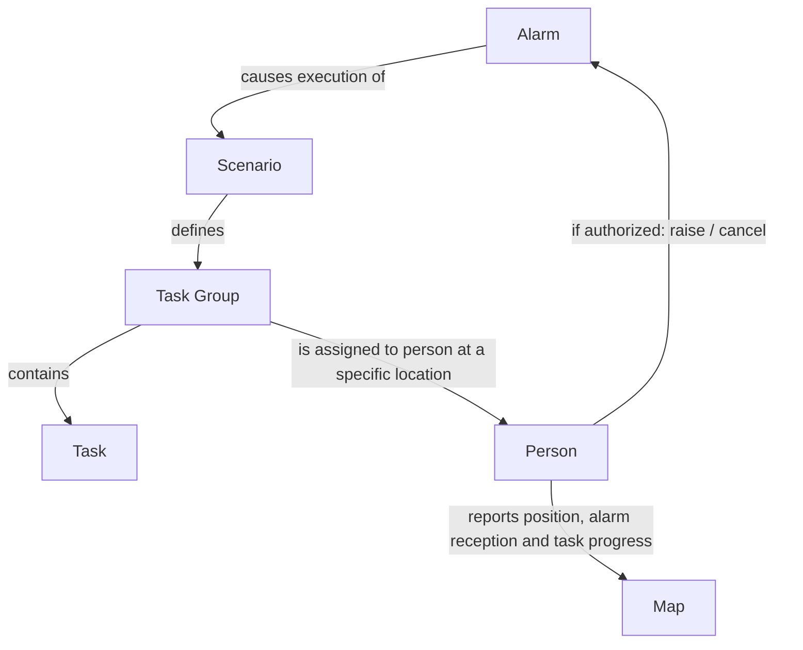
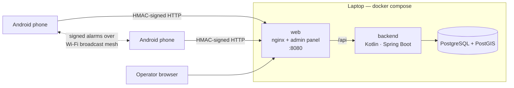

# Siren (pol. Wyjec)

**Siren** is a flexible system for distributing tasks and coordinating people during emergencies, based on predefined scenarios. It is intended for organizations that need to coordinate a response across people, tasks, and locations, including civil administration, medical services, and the military.

When an alarm is raised, it activates an associated scenario. A scenario defines one or more task groups; each group contains tasks and is assigned to a person at a specific location.

## How It Works

1. An authorized person raises an alarm.
2. The alarm activates its associated scenario.
3. Task groups are distributed to the people and locations specified by the scenario.
4. Participants report alarm reception and task progress. When enabled and available, their positions can also be shown on a map.
5. An authorized person can cancel the alarm.

## Concepts

- **Alarm:** An event that starts or cancels an emergency response.
- **Scenario:** A predefined response plan associated with an alarm.
- **Task group:** A set of tasks assigned to a person at a location.
- **Assignment:** The person and location responsible for carrying out a task group.



Alarms can be raised and cancelled by authorized people. The right to raise or cancel an alarm type is granted per person (their role), not tied to whoever raised it, so any authorized controller can end an alarm. Every alarm applies system-wide; there is no geographic targeting. The person raising it can add a short description, and every recipient sees that text exactly as entered.

Scenarios are distributed to devices and stored offline. Alarm delivery is designed not to require the Internet or a centralized server, and can use different communication technologies. Actual delivery still depends on an available communication path; offline devices can use their stored scenarios but cannot exchange updates until a path is available.

During an active alarm, the system collects participants' alarm reception status, task progress, help requests, and, when available, position to provide an overview on a map. Location is collected **only while an alarm is active**: phones do not send it otherwise, the server rejects it otherwise, and positions gathered during an alarm are deleted when the alarm ends.


## Triple Use

### CIV — Civil Administration

**Air raid alarm**

One alarm, three different responsibilities:

- **School Director** → school protected area: stop outdoor activities, move pupils and staff to the protected area, account for everyone.
- **City Mayor** → Municipal Crisis Management Centre: activate the municipal crisis procedure, switch City Hall to emergency operation, check that key units acknowledged.
- **Emergency Department Manager** → ED coordination / triage area: activate mass-casualty readiness, prepare triage capacity, verify staffing and supplies.

### MED — Medical

**Mass-casualty alarm in the Emergency Department**

An emergency response scenario assigns medical staff to specific locations:

- anesthesiologist → Emergency Department,
- surgeon → operating theatre,
- nurses → triage area,
- radiology technician → imaging department.

### MIL — Military

**Mobilization alarm**

A soldier is ordered to:

- go to the equipment store where he collects equipment and takes ammunition
- go to designated bunker where he takes up a guard position

---

# Prototype

A working prototype of the whole system runs on one laptop: database, backend, admin panel, and an Android app for phones on the same Wi‑Fi.



| Folder | What it is |
|---|---|
| `database/` | Flyway migrations implementing `siren_db_schema.png` (`migrations/`) plus demo data (`demo/`) |
| `backend/` | Kotlin + Spring Boot API: device sync, alarm ingest + verification, status, admin API, live updates (SSE) |
| `admin_panel/` | React + Vite + Leaflet operations console with two sections: **LIVE** (raise alarm; live map only while an alarm is active) and **SCENARIOS** |
| `mobile/` | Android app (Kotlin, Jetpack Compose): offline procedures, raise alarm, active-alarm checklist, need help, mesh relay, controller raise/cancel |
| `DEMO.md` | Step-by-step script for presenting to customers |

## Quick start

Requirements: Docker with Compose. For the phone app: JDK 21 and the Android SDK (or install the prebuilt APK).

```bash
./siren.sh up        # build + start everything (first build takes a few minutes)
```

* Admin panel: <http://localhost:8080>, log in with **admin / siren** (also `hospital` and `army`).
* Phones: `./siren.sh url` prints the LAN address, for example `http://192.168.1.20:8080`.

Other commands: `./siren.sh down`, `./siren.sh reset` (wipes the DB: fresh demo data and keys), `./siren.sh logs`.

## Android app

```bash
./siren.sh apk                       # → dist/siren.apk
adb install -r dist/siren.apk        # or copy the file to the phone and open it
```

On first start, enter the laptop address shown by `./siren.sh url` and tap a demo person. For the air-raid demo, enroll three phones as **Ewa Dąbrowska** (School Director), **Andrzej Malinowski** (City Mayor) and **Dr Robert Krawczyk** (Emergency Department Manager). Allow notifications and location.

To update the app, run `./siren.sh apk` again and reinstall with `adb install -r`. After `./siren.sh reset`, re-enroll each phone (**⋮ → Unenroll this phone**), because the server keys change.

* Laptop firewall: allow inbound TCP 8080 (for example `sudo ufw allow 8080/tcp`).
* Mesh relay: phones on the same Wi‑Fi pass signed alarms to each other over UDP broadcast port 47474. This works with the server stopped. Guest or corporate networks with client isolation block it; a phone hotspot works.
* Emulator: the server address is `http://10.0.2.2:8080`. Emulators cannot join the mesh.

## Demo data

Air raid is the primary demo scenario (see `DEMO.md`):

| Person | Role | Air raid destination | Can end air raid |
|---|---|---|---|
| Katarzyna Nowak | Crisis Management Operator (admin panel: `admin`) | — | yes |
| Andrzej Malinowski | City Mayor | Municipal Crisis Management Centre | yes |
| Ewa Dąbrowska | School Director | Primary School No. 5 protected area | no |
| Dr Robert Krawczyk | Emergency Department Manager | ED coordination / triage area | no |

Alarm types: Air raid, Drone strike, Major fire / smoke, Hazardous chemical release, Flood, Critical infrastructure failure, Major power outage, Security incident and Evacuation order (Kraków), plus Mass-casualty incident (hospital, MED) and Mobilization (army, MIL). Air raid, Drone strike, Mass-casualty incident and Mobilization have full playbooks; the other types can be raised but have no tasks yet.

## How the security model is implemented

| SECURITY.md | Prototype |
|---|---|
| Server–App channel, individual symmetric credentials | Every device request carries `HMAC-SHA256(psk, METHOD\nPATH?QUERY\nTIMESTAMP\nsha256(body))`; ±5 min clock skew |
| Alarm cryptography, asymmetric | ECDSA P‑256 per organization and key epoch. Every receiving device gets the public key; only alarm controllers get the private key |
| Authenticity independent of server and medium | Phones verify every message themselves, whether it came from the server poll or the mesh. The server verifies it again, together with the controller's rights |
| Replay protection | Message id unique; CANCEL is terminal; events past `key_epoch.valid_to + 24 h` or in the future are rejected; forged copies are never stored |
| Key updates | CURRENT plus a pre-distributed NEXT epoch, then GRACE and RETIRED, rotated hourly by the backend |
| Data minimization | Position is accepted only for an active alarm and deleted when that alarm ends; phones request location updates only while an alarm is active |
| Offline operation | Scenario bundles (own task groups only, SHA‑256 checked) and keys are stored in on-device SQLite; status waits in an outbox until a path to the server exists |

### Prototype shortcuts (do not deploy as is)

* The HSM is a DB table (`prototype_hsm_secret`), and the object store is `prototype_object_store`.
* Plain HTTP on the LAN. The protocol is authenticated, but production adds TLS.
* Phone storage is not encrypted, and keys live in app storage instead of the TEE keystore.
* Operator sessions are kept in memory and passwords are bcrypt hashes in the DB. There is no SSO.
* The mesh uses Wi‑Fi broadcast; it stands in for BLE, Wi‑Fi Direct, LoRa and pagers.
* Map tiles come from openstreetmap.org, so the laptop needs Internet for the map background.

## Development

```bash
docker compose up -d db                                         # Postgres on localhost:5433
cd backend && JAVA_HOME=/usr/lib/jvm/java-21-openjdk-amd64 DB_PORT=5433 ./gradlew bootRun   # API on :8081
cd admin_panel && npm install && npm run dev                    # UI on :5173, proxies /api to :8081
```

Device API (`/api/device/**`, HMAC): `GET sync`, `GET alarms?since=`, `POST alarms` (signed raise/cancel or a relayed copy), `POST status`.
Admin API (`/api/admin/**`, bearer token): alarm definitions, scenarios, raise (type + description)/cancel, active alarms and live detail, history, event log, people, keys, `stream` (SSE).
