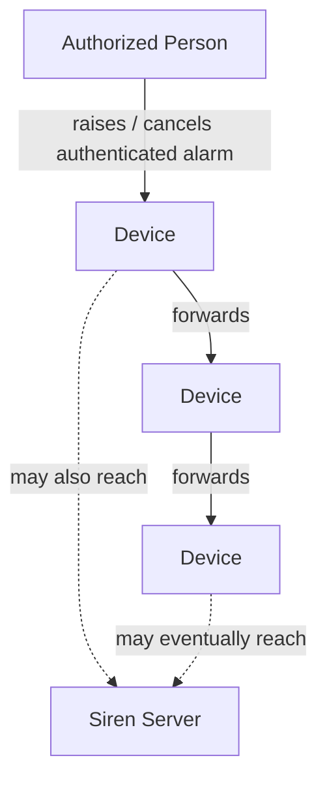

# Siren — Security

## Overview

Siren uses **two separate cryptographic mechanisms** for two different purposes:

1. **Server–App communication** — protects communication with the Siren server, including scenario distribution and operational status updates.
2. **Alarm cryptography** — authenticates alarm messages and their **raise / cancel** events independently of the server and communication medium.

These two mechanisms are independent. An alarm can therefore be authenticated and propagated without using the Server–App communication channel.

## 1. Server–App Communication

Communication between the Siren server and the mobile application is protected using a dedicated cryptographic mechanism based on **individually distributed credentials**.

This channel is used for:

- downloading and updating scenarios,
- distributing the cryptographic material required for alarm handling,
- reporting alarm reception and task status,
- other communication between the application and the Siren server.

The user/device connects to the server using its unique credentials. The intended model is based on **symmetric, individually distributed credentials**, conceptually similar to pre-shared credentials used in VPN systems.

Scenario updates and status updates therefore use the **Server–App security mechanism** and require an online connection to the Siren server.

## 2. Alarm Cryptography

Alarm communication uses a separate **asymmetric cryptographic scheme**.

When scenarios are distributed to users, the cryptographic material required for alarm handling is distributed as part of the update:

- every user who can receive alarms obtains the **public key** used to verify alarm messages;
- users authorized to control alarms also obtain the corresponding **private key**, which allows them to create authenticated alarm messages.

The private key is therefore held only by users authorized to **raise or cancel alarms**.

The alarm cryptographic mechanism is independent of the Siren server. A valid alarm does not have to be received from the server and does not have to travel through the Server–App communication channel.

## Alarm Message

When an authorized user raises or cancels an alarm, an authenticated alarm message is created containing the information required to identify and validate the event, including:

- alarm identifier,
- alarm type / scenario reference,
- event type — **raise** or **cancel**,
- timestamp,
- source / origin identifier,
- cryptographic authentication data.

The message is authenticated using the private key of an authorized alarm controller.

A receiving device verifies the message using the distributed public key before accepting the event.

## Mesh Alarm Propagation

Alarm propagation is based on **mesh forwarding** between reachable devices and does not depend on a single communication path.

Every device receiving a valid alarm message can **repeat / forward the message** to other reachable devices. The communication medium is independent of the alarm protocol and may change between hops.



An alarm may propagate through available communication paths such as radio, Bluetooth, pager networks, mesh networks, or Internet-based communication. It can therefore reach users **before reaching the central server**, or without the server being available at all.

The Siren server is not a mandatory point through which every alarm must pass.

## Alarm Validity and Replay Protection

Because alarm messages can be forwarded and received through disconnected or delayed communication paths, the protocol must distinguish a new event from an old copy of an event.

The alarm timestamp and unique identifiers are therefore part of the authenticated message and are used when validating received events.

The detailed replay-protection rules are a separate protocol-design item and should define, at minimum, how devices handle:

- repeated copies of the same alarm,
- delayed delivery,
- stale alarms,
- repeated raise / cancel messages.

## Key Updates

Scenarios are periodically distributed and stored offline on user devices.

Scenario updates are delivered through the **protected Server–App communication channel**. The update also provides **new alarm-related cryptographic key material** for the next cryptographic context.

The two cryptographic mechanisms therefore have different roles:


The application can continue to use its locally stored scenarios while disconnected from the server. It cannot receive newer scenarios, new alarm keys, or send status updates until an online communication path becomes available.

## Status Updates

Operational status information is reported to the Siren server **only when an online communication path is available**.

This includes information such as:

- alarm reception,
- task progress,
- other operational status,
- position, when position reporting is enabled and available.

Status updates use the same **Server–App cryptographic protection** as scenario distribution. They are not part of the mesh alarm propagation mechanism.

## Security Principle

The two mechanisms provide a clear separation:

```text
Server–App Security
        │
        ├── scenario download / update
        └── online status reporting

Alarm Cryptography
        │
        ├── raise alarm
        ├── cancel alarm
        └── decentralized alarm propagation
```

The central principle is:

> **The authenticity of an alarm does not depend on the server or on the communication medium used to deliver it.**
